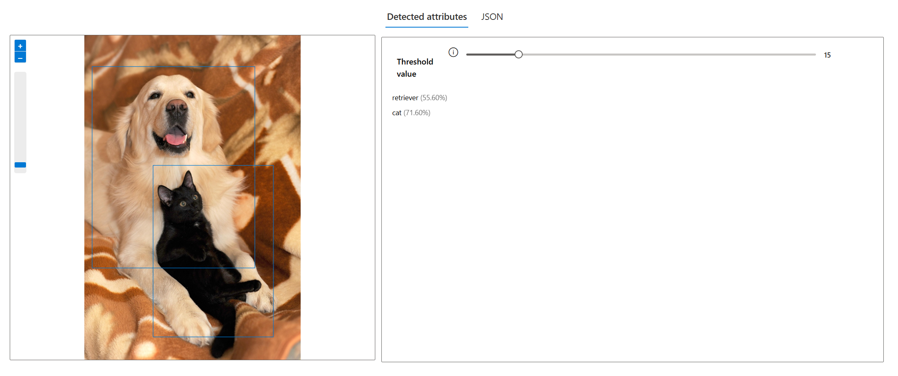
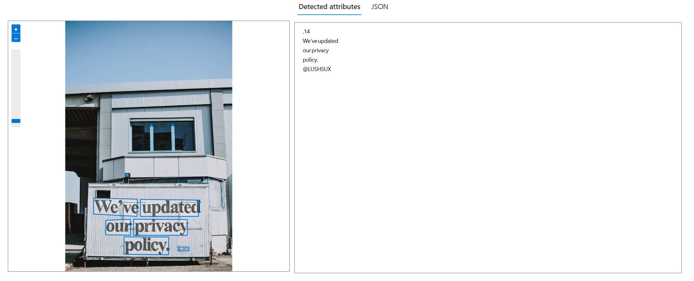

# Projeto Vision AI

## Objetivo

Este projeto tem como objetivo a análise de imagens utilizando o [Vision Studio](https://portal.vision.cognitive.azure.com).

## Processo

- Pesquisar imagens para o projeto em sites gratuitos, por exemplo [Pixabay](https://pixabay.com).
- Carregar imagens para a pasta `inputs/`.
- Processar cada imagem no Vision Studio:
  - Analyze → detecção de animais, cão e gato
  - Text → extração de texto do grafiti
- Resultados colocados na pasta `output/`.

## Exemplos

- Analyze:
  
- Text:
  

## Insights

- As imagens com fundo claro parecem funcionar melhor para OCR
